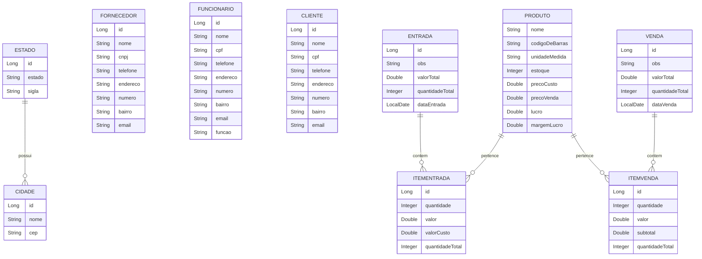

# 🛒 Sistema de Vendas

Sistema web desenvolvido para gerenciamento de vendas, estoque, clientes, fornecedores e entradas de produtos utilizando Java + Spring Boot.

---

# 📌 Funcionalidades

✅ Cadastro de Estados  
✅ Cadastro de Cidades  
✅ Cadastro de Clientes  
✅ Cadastro de Funcionários  
✅ Cadastro de Fornecedores  
✅ Cadastro de Produtos  
✅ Controle de Estoque  
✅ Registro de Entradas  
✅ Registro de Vendas  
✅ Controle de Itens de Entrada  
✅ Controle de Itens de Venda  
✅ Cálculo de Lucro e Margem de Lucro  

---

# 🚀 Tecnologias Utilizadas

| Tecnologia | Descrição |
|---|---|
| Java | Linguagem principal |
| Spring Boot | Framework backend |
| Spring MVC | Arquitetura MVC |
| Spring Data JPA | Persistência de dados |
| Thymeleaf | Template Engine |
| PostgreSQL | Banco de dados |
| Bootstrap | Frontend responsivo |
| Maven | Gerenciador de dependências |

---

# 🗂️ Estrutura do Projeto

```bash
src
 ┣ main
 ┃ ┣ java
 ┃ ┃ ┗ br.com.sistema
 ┃ ┃ ┣ controller
 ┃ ┃ ┣ model
 ┃ ┃ ┣ repository
 ┃ ┃ ┣ service
 ┃ ┃ ┗ config
 ┃ ┣ resources
 ┃ ┃ ┣ templates
 ┃ ┃ ┣ static
 ┃ ┃ ┗ application.properties
 ┗ test
```

---

# 🧱 Modelagem do Banco de Dados

## 📍 Estado

| Campo | Tipo |
|---|---|
| id | Long |
| estado | String |
| sigla | String |

---

## 📍 Cidade

| Campo | Tipo |
|---|---|
| id | Long |
| nome | String |
| cep | String |

---

## 📍 Fornecedor

| Campo | Tipo |
|---|---|
| id | Long |
| nome | String |
| cnpj | String |
| telefone | String |
| endereco | String |
| numero | String |
| bairro | String |
| email | String |

---

## 📍 Funcionário

| Campo | Tipo |
|---|---|
| id | Long |
| nome | String |
| cpf | String |
| telefone | String |
| endereco | String |
| numero | String |
| bairro | String |
| email | String |
| funcao | String |

---

## 📍 Cliente

| Campo | Tipo |
|---|---|
| id | Long |
| nome | String |
| cpf | String |
| telefone | String |
| endereco | String |
| numero | String |
| bairro | String |
| email | String |

---

## 📍 Produto

| Campo | Tipo |
|---|---|
| nome | String |
| codigoDeBarras | String |
| unidadeMedida | String |
| estoque | Integer |
| precoCusto | Double |
| precoVenda | Double |
| lucro | Double |
| margemLucro | Double |

---

## 📍 Entrada

| Campo | Tipo |
|---|---|
| id | Long |
| obs | String |
| valorTotal | Double |
| quantidadeTotal | Integer |
| dataEntrada | LocalDate |

---

## 📍 Venda

| Campo | Tipo |
|---|---|
| id | Long |
| obs | String |
| valorTotal | Double |
| quantidadeTotal | Integer |
| dataVenda | LocalDate |

---

## 📍 ItemEntrada

| Campo | Tipo |
|---|---|
| id | Long |
| quantidade | Integer |
| valor | Double |
| valorCusto | Double |
| quantidadeTotal | Integer |
| entrada | Entrada |
| produto | Produto |

---

## 📍 ItemVenda

| Campo | Tipo |
|---|---|
| id | Long |
| quantidade | Integer |
| valor | Double |
| subtotal | Double |
| quantidadeTotal | Integer |
| venda | Venda |
| produto | Produto |

---

# 🔗 Diagrama de Relacionamento



---

# ⚙️ Configuração do Banco de Dados

## 📍 PostgreSQL

Crie o banco:

```sql
CREATE DATABASE sistema_vendas;
```

---

# ⚙️ application.properties

```properties
spring.application.name=sistema-vendas

spring.datasource.url=jdbc:postgresql://localhost:5432/sistema_vendas
spring.datasource.username=postgres
spring.datasource.password=sua_senha

spring.jpa.hibernate.ddl-auto=update
spring.jpa.show-sql=true
spring.jpa.properties.hibernate.format_sql=true
```

---

# ▶️ Como Executar

## 1️⃣ Clonar o Projeto

```bash
git clone https://github.com/seu-usuario/sistema-vendas.git
```

---

## 2️⃣ Entrar na Pasta

```bash
cd sistema-vendas
```

---

## 3️⃣ Executar o Projeto

### Linux / Mac

```bash
./mvnw spring-boot:run
```

### Windows

```bash
mvnw spring-boot:run
```

---

# 📊 Funcionalidades do Sistema

| Módulo | Descrição |
|---|---|
| Clientes | Cadastro e gerenciamento |
| Funcionários | Controle de funcionários |
| Fornecedores | Cadastro de fornecedores |
| Produtos | Controle de estoque |
| Entradas | Entrada de mercadorias |
| Vendas | Registro de vendas |
| Itens | Controle detalhado dos produtos |

---

# 🧠 Conceitos Aplicados

- Programação Orientada a Objetos
- Arquitetura MVC
- Relacionamento entre Entidades
- CRUD Completo
- Persistência com JPA/Hibernate
- Validação de Dados
- Controle de Estoque
- Regras de Negócio

---

# 📸 Telas do Sistema

- Tela de Login
- Dashboard
- Cadastro de Clientes
- Cadastro de Produtos
- Cadastro de Funcionários
- Controle de Entradas
- Controle de Vendas
- Controle de Estoque

---

# 👨‍💻 Autor

## José Jonadabe S. Barros
[](https://www.instagram.com/jonadabedev?igsh=NGo0ejlqczNmMTVn)
[](https://www.linkedin.com/in/josé-jonadabe-s-barros-2395043b7?utm_source=share_via&utm_content=profile&utm_medium=member_android)


Desenvolvedor Java | Spring Boot | PostgreSQL

---
